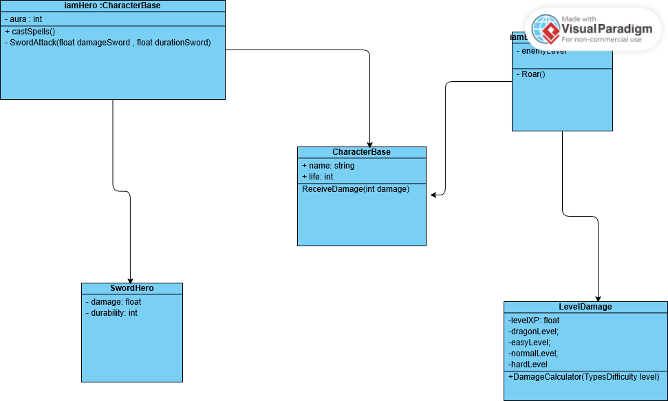

## Fase 8: Do Diagrama ao Código - Associação, Encapsulamento e Enums

**Data:** 13.03.26 | **Matéria:** C# e Orientação a Objetos na Unity

---

| **CONCEITOS ARQUITETURAIS** | Na Prática |
| :--- | :--- |
| **A Regra de Ouro: Herança vs Associação**   Saber a diferença entre desenhar um encanamento de Herança ou de Associação é o que define se o jogo vai rodar ou quebrar. A regra é o teste lógico. | **Anatomia das Ligações:**  1. **Herança ("É UM") -->** O Inimigo *é um* Personagem base.  *(No C#: `public class IamEnemy : CharacterBase`)*  2. **Associação ("TEM UM") -->** O Herói *tem uma* Espada.  *(No C#: Criamos uma variável `public SwordHero minhaEspada;` dentro do Herói para criar a "ponte").* |
| **Encapsulamento (A Porta Trancada)**  **Lógica:** Segurança em primeiro lugar.  **O que é?**   Usei o encapsulamento para trancar as variáveis da nossa classe, impedindo que outros scripts alterem a vida ou o dano de forma acidental e causem bugs. | **A Mágica do `[SerializeField]`:**  Usei : `[SerializeField] private float damageSword;`  O `private` tranca a porta no código. O `[SerializeField]` abre uma "janela de vidro" apenas visual para podermos editar o valor livremente lá no painel (Inspector) da Unity. |
| **Enums (O Menu Drop-down)**  **O Problema:** Escrever lógicas usando textos (strings) pode causar erros de digitação e confusão.  **A Solução:** Criamos uma lista de categorias (Enum). Isso gera um menu limpo e selecionável direto na Unity. | **Exemplo de Uso (Nível de Ameaça):**  `public enum TypesDifficulty` `{ Easy, Normal, Hard, Dragon }`  O sistema não aceita outra coisa. Ou o inimigo é um desses 4, ou não é nada. Isso centraliza a regra de negócio. |
 | **O Perigo do `Update()`:**  Nunca coloque um `Debug.Log` dentro do método `Update()`, pois ele roda 60 vezes por segundo e trava a máquina. Para testes ou definições iniciais, use sempre o **`Start()`**, que roda apenas uma vez quando o objeto nasce. |
|

### A Planta Baixa (Diagrama de Classes Oficial)

