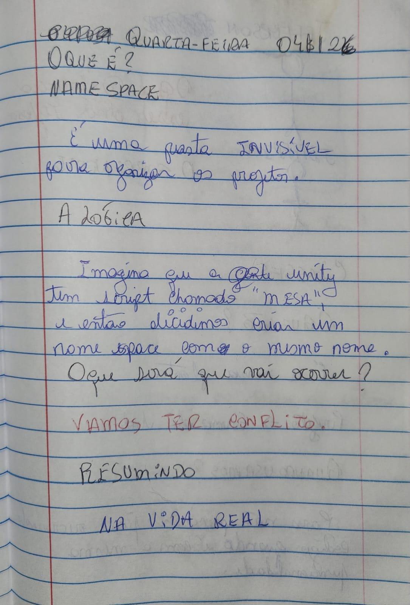
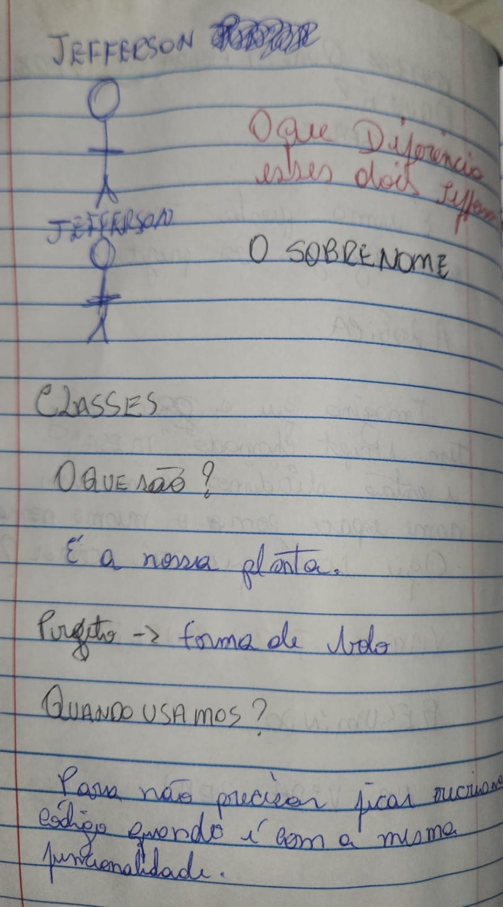
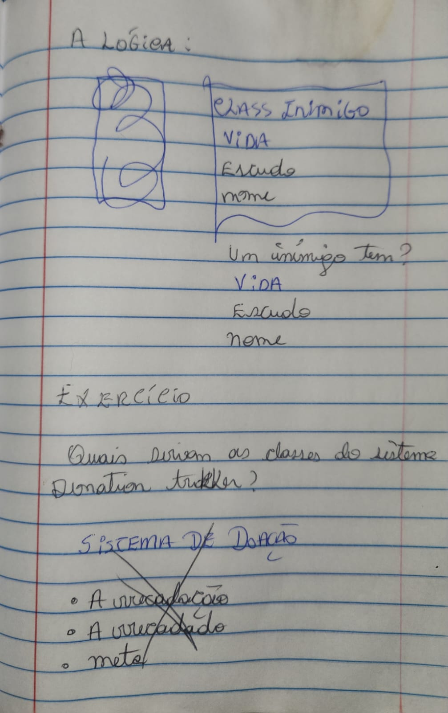

# Summary

- [How This Work ?](#section-1)
- [What's Namespace and Class? ](#section-2)
#

# Module C# intermediate 

## **How this work?**

## **What's Namespace And Class?**

<<<<<<< HEAD
## **Complemented By Exercise 09_InventorySystemRE4**

Which the different between "junior" then "senior" programmer in this resumy?

Is the "`Control`" 

The junior set all a public type to make easier to see in the inspector. The senior just builds a vault.

=======

# Notas Cornell: Arquitetura de Comunicação (Unity)
Data: 23/03/2026 | Matéria: C# Avançado - Métodos vs Eventos

---

| TÓPICOS / GATILHOS (Cues) | ANOTAÇÕES PRÁTICAS (Notes) |
| :--- | :--- |
| **Método (Method)** | É uma **ordem direta** (Comunicação 1 para 1). • *Como funciona:* O Script A manda o Script B fazer algo. • *Analogia:* Uma ligação telefônica privada. Você precisa saber o número exato da pessoa. • *Exemplo:* `telaUI.LigarTela();` |
| **Acoplamento Forte** *(O Perigo dos Métodos)* | É quando os "tijolos estão colados". • Se o Script B for deletado, o Script A quebra e o jogo trava (Erro: `NullReferenceException`), porque o A dependia do B para funcionar. |
| **Evento (Event / Action)** | É um **aviso geral** (Comunicação 1 para Muitos). • *Como funciona:* O Script A apenas "grita" que algo aconteceu. Ele não faz ideia de quem está escutando. Quem se interessar, reage. • *Analogia:* O Alarme de Incêndio da fábrica. |
| **Acoplamento Fraco** *(A Vantagem dos Eventos)* | É a arquitetura "Lego". Módulos independentes. • Se a UI for deletada, o jogo **não quebra**. O Mercante simplesmente grita para o vazio, e a vida segue normalmente. |
| **Quando usar cada um?** | • **Métodos:** Para a lógica interna do próprio script (ex: o Leon calculando se tem dinheiro). • **Eventos:** Para sistemas diferentes conversarem (ex: O Mercante avisando a UI para ligar, o Áudio para tocar e o Leon para travar o movimento). |

---

### Resumo (Summary)
> A diferença entre um programador Júnior e um Sênior está no controle do **Acoplamento**. Usar *Métodos* para ligar sistemas diferentes cria um código frágil ("espaguete"), onde deletar um objeto quebra o jogo inteiro. Usar *Eventos* (como `UnityEvents` ou `Action` em C#) cria uma arquitetura modular, permitindo que a Loja, a UI, o Áudio e o Jogador funcionem de forma totalmente independente. O Mercante apenas anuncia a abertura da loja; os outros sistemas escutam e reagem por conta própria.

# Notas Cornell: A Pegadinha do "Invoke" na Unity
Data: 23/03/2026 | Matéria: C# Avançado - Sintaxe e Eventos

---

| TÓPICOS / GATILHOS (Cues) | ANOTAÇÕES PRÁTICAS (Notes) |
| :--- | :--- |
| **1. O Invoke do MonoBehaviour** *(O Cronômetro)* | É uma função de **tempo**. Ele diz para a engine esperar "X" segundos e depois rodar um *método*. • *Sintaxe:* `Invoke("NomeDoMetodo", 4f);` • *O Problema:* Ele exige o nome do método em texto (String Mágica). Se você mudar o nome do método depois, o texto não atualiza sozinho e o jogo quebra silenciosamente. • *Dica de Sênior:* Para evitar o erro do texto, usamos `nameof(NomeDoMetodo)`, que converte o nome real em texto com segurança. |
| **2. O Invoke do UnityEvent** *(O Megafone)* | É a função de **disparo imediato** de um evento. Ele não tem nada a ver com tempo. Ele apenas pega a variável do evento e grita: "Aconteceu!". • *Sintaxe:* `meuEvento.Invoke();` • *Como funciona:* Ele varre a lista de todo mundo que está escutando aquele evento e manda todos executarem suas ações na mesma hora. |
| **O Escudo Protetor: `?.`** *(Null-Conditional Operator)* | Se você disparar um evento que não tem ninguém escutando (A lista está vazia / Null), a Unity dá erro de `NullReferenceException`. • *A Solução:* Colocar uma interrogação antes do ponto. • *Sintaxe:* `meuEvento?.Invoke();` • *Tradução:* "Dispare o evento, **SE** a lista de ouvintes não for nula". |

---

### Resumo (Summary)
> Na Unity, a palavra `Invoke` tem dois significados completamente diferentes dependendo de *quem* está chamando. Se você chama direto no script (`Invoke()`), é um **timer** (cronômetro) para rodar um método no futuro. Se você chama a partir de uma variável de evento (`onShopOpened.Invoke()`), é um **gatilho** imediato para avisar outros sistemas (UI, Áudio, etc.) que uma ação acabou de acontecer, seguindo a arquitetura de baixo acoplamento.
>>>>>>> 20594efd42a5cb9c65d8ff50dedf31c0ab2f12f8
