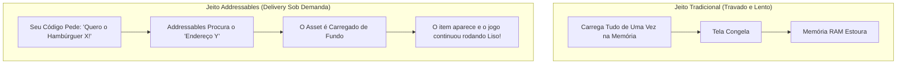
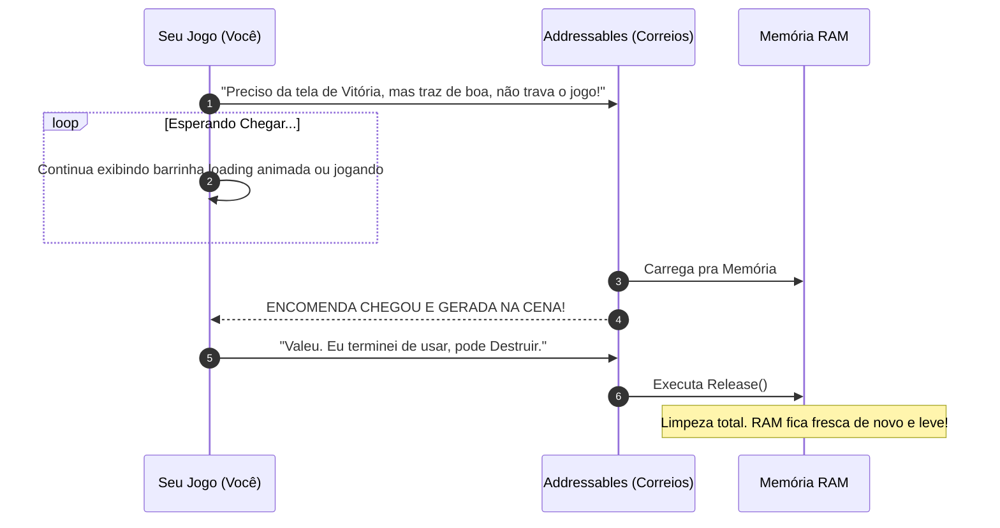
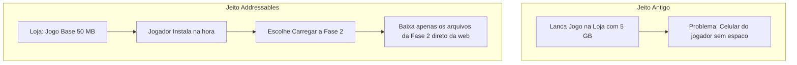
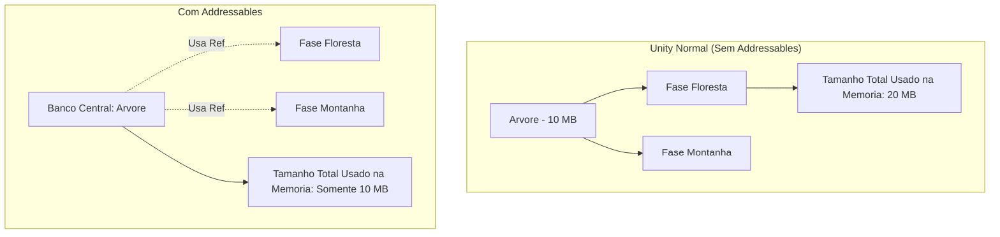
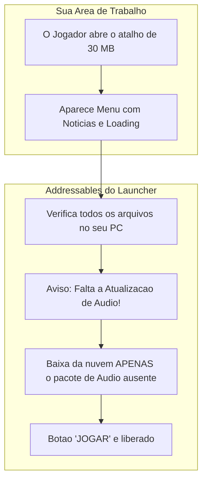
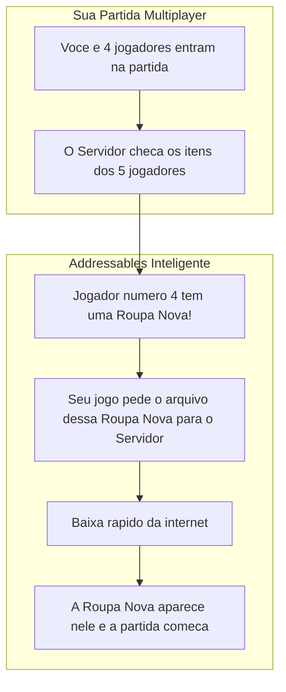
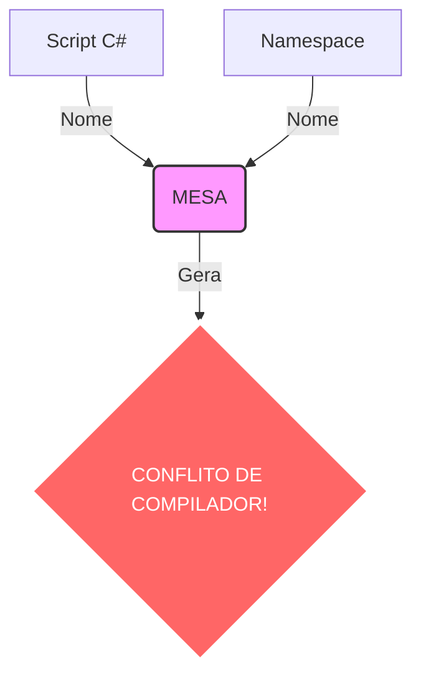
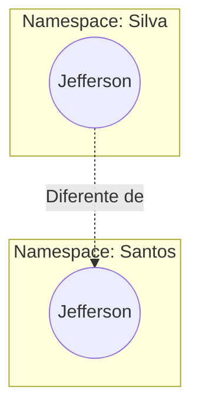
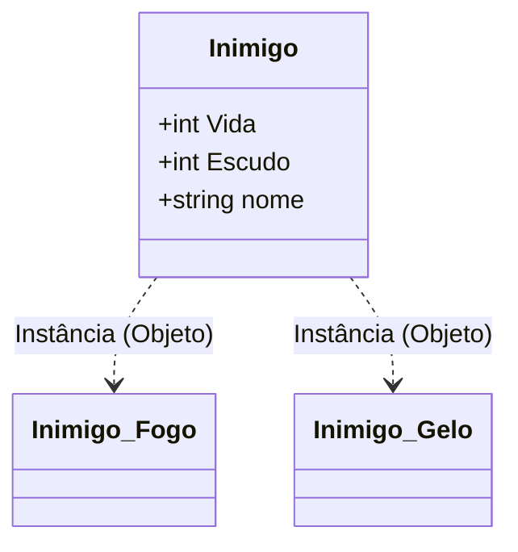

#  Índice (Summary)

- [Unity Addressables (O Jeito Fácil de Entender)](#addressables)
- [Module C# Intermediate](#module-cs)
- [Arquitetura de Comunicação (Unity)](#arquitetura-comunicacao)
- [A Pegadinha do "Invoke" na Unity](#pegadinha-invoke)

---

<a id="addressables"></a>
# Dossiê Técnico: Unity Addressables (O Jeito Fácil de Entender)
**Data:** 23/04/2026
**Assunto:** O que realmente são Addressables na Unity? (Versão "Sopa de Letrinhas")

---

## 1. O que é esse tal de Addressables?

Imagina que o seu jogo é um **Restaurante Gigante**:
- **O jeito antigo (Resources / Arrastar pro Inspector):** Você guarda TODOS os ingredientes (texturas, sons, modelos 3D) dentro da pequena cozinha (sua Memória RAM) o tempo todo. A cozinha fica absurdamente lotada, a tela congela e o jogo demora muito pra abrir!
- **O jeito Addressables:** Você guarda os ingredientes em um **Armazém Infinito** maravilhosamente organizado (pode ser no seu HD ou até num servidor da nuvem). Quando o cliente pede uma "Espada Mágica", você manda uma mensagem pro Armazém pelo "Endereço" (Address) dela. Um motoboy pega ela e traz só na hora que você precisar!

**Vantagem Máxima:** O seu jogo abre super rápido, a tela não tem mais aqueles travamentos (congelamentos) chatos, e você não esgota a memória do celular/PC do seu jogador!

### Fluxo do Restaurante (Como funciona)


---

## 1.5. Onde ele fica e O que ele guarda? (Ajustando os Mitos)

Se voce entendeu que o Addressables e como um "Armazem de Entregas", e preciso ter clareza perfeita sobre dois pontos:

1. **A Nuvem nao e obrigatoria (Pode ser um Armazem Offline):**
O Addressables funciona de forma identica se o Armazem estiver na Nuvem (um servidor na internet) ou "escondido" no proprio disco rigido do PC/Celular, sem internet. O jogo offline continuara chamando os itens sob demanda, do HD para a Memoria RAM. Para o Addressables, so importa o "Endereco". Nao interessa se o entregador vem da rua (Nuvem) ou de um quartinho nos fundos da sua propria casa (Armazenamento Local do HD).

2. **Ele guarda Pecas (Assets), e nao Codigos em Texto Puros:**
O sistema foi feito para gerenciar "Assets" (Texturas, Musicas, Modelos 3D, Fases inteiras). Ele nao serve para baixar "Linhas de Codigo de Funcoes" em texto da internet. Porem, o segredo e que ele carrega **Prefabs**. E como um Prefab traz componentes e regras grudadas nele, indiretamente voce estara importando "caixas fechadas" prontas contendo scripts e funcoes que operam sozinhas.

---

## 2. Glossário: Tudo sobre Addressables (Explicado para Crianças de 5 anos)

| Termo Esquisito | O que significa de verdade? (Exemplo Bobo) |
| :--- | :--- |
| **Address (Endereço)** | É literalmente o nome/CEP da sua encomenda. Em vez de arrastar o modelo 3D pro seu script, você agora só grita pelo nome: _"Espada_de_Fogo"_, _"Musica_do_Chefe"_. |
| **AssetReference** | É uma caixinha de correio vazia no Inspector do seu script onde você clica e escolhe o que quer. Funciona como um "Voucher do Ifood": não é a comida, é só a garantia de que ela vai ser pedida depois. |
| **Load / Instantiate Async (Assíncrono)** | A Palavra Mágica. Significa "Carrega essa parada de fundo enquanto eu faço outra coisa". Você pede a pizza e vai jogar videogame até ela chegar. O jogo nunca trava pra esperar! |
| **Release (Liberar / Soltar)** | Mandar o prato vazio de volta pra pia. Se você carregou a Espada e o personagem morreu (não vai mais usar), você DEVE dar um `Release()`! Se você não liberar a memória, as caixas acumulam, a RAM explode e o jogo crasha! |
| **Groups (Grupos)** | São os corredores do armazém organizados de forma lógica. A prateleira (Group) "Sons de Zumbi" no corredor A, Prateleira "Armas de Fogo" no corredor B. Mantém tudo limpinho. |
| **Profiles (Perfis de Construção)** | Configuração que avisa o "motoboy" onde ele pega a encomenda. Ele vai buscar a Espada dentro do PC local (Local Build) ou vai baixar direto da internet (Remote)? |

---

## 3. Como usar no Código? (Comentado Passo a Passo)

Para o motoboy do delivery funcionar:

```csharp
using UnityEngine;
using UnityEngine.AddressableAssets; 
// 1. A Agência de Delivery (Addressables)
using UnityEngine.ResourceManagement.AsyncOperations; 
// 2. O Rastreio do Correio (Saber quando o motoboy chegou)

public class CaixaMagica : MonoBehaviour
{
    // Onde você bota o "Voucher" no Inspector
    public AssetReference voucherDoDragao;

    void Start()
    {
        // Pede a criatura sem travar o jogo! (Delivery Assíncrono)
        // Quando a entrega "COMPLETAR", chame a função "ChegouAEncomenda"
        Addressables.InstantiateAsync(voucherDoDragao).Completed += ChegouAEncomenda;
    }

    // O que acontece quando o motoboy bate na porta?
    private void ChegouAEncomenda(AsyncOperationHandle<GameObject> motoboyDaEntrega)
    {
        // Checamos se a entrega deu certo!
        if (motoboyDaEntrega.Status == AsyncOperationStatus.Succeeded)
        {
            Debug.Log("O Dragao chegou quentinho!");
        }
        else 
        {
            Debug.Log("Motoboy caiu e perdeu o lanche (Erro de carregamento)");
        }
    }
}
```

### Fluxo de Comunicação e Segurança (Como não explodir a memória)


---

## 4. Visão de Sênior: O que ele faz nos bastidores?

O Addressables não serve apenas para deixar o carregamento escondido. Para quem trabalha fazendo jogos gigantes, ele resolve os tres maiores pesadelos dos programadores.

### A. Atualizacao pela Nuvem (O Jogo Casca)
Se o seu jogo pesa 5 Gigabytes, poucas pessoas vao baixar na loja de celular. Se tiver uma nova roupa para um personagem, o jogador tera que baixar o jogo pesado tudo de novo na loja. 
Com o Addressables, voce publica na loja apenas um "App Casca" bem leve (exemplo: 50 MB). O resto (Fases, Roupas, Chefões) fica guardado na internet em servidores da AWS ou Unity. 



### B. Reuso Inteligente (Fim dos Arquivos Repetidos)
Se voce tem a mesma "Textura de Arvore" na Fase da Floresta e na Fase da Montanha, o sistema padrao da Unity e cego e joga o arquivo da arvore duas vezes na build final do jogo, duplicando o tamanho.
O Addressables rastreia dependencias. Ele cria apenas UMA Arvore em um banco central, e entrega apenas atalhos vazios para as fases.



### C. A Velocidade de Teste no Computador
Para testar fases muito complexas no modo antigo (Asset Bundles), o programador tinha que esperar a Unity empacotar e compilar arquivos pesados fisicamente. Demorava minutos.
Com Addressables, basta ligar a opcao "Use Asset Database". Ao apertar o Play, a engine simula o carregamento perfeitamente usando atalhos virtuais sem compilar nada. O que levava 5 minutos agora testa de imediato.

---

## 5. Exemplos de Uso no Mundo Real (Na Pratica)

Onde grandes empresas usam esse sistema no dia a dia?

### A. O Launcher do Jogo (A Sala de Espera)
Sabe quando voce baixa um jogo famoso (como um MMO ou um RPG grande) e ele instala muito rapido? Mas quando voce abre, tem uma tela bonita com noticias e uma barra gigante de carregamento escrito "Baixando o Jogo"?
Aquela primeira tela se chama "Launcher". O Launcher e um executavel miniatura (algo como 30 MB) que usa o mecanismo do Addressables para baixar o jogo real pedaco por pedaco. Assim, se houver um erro em um arquivo especifico, o Launcher so refaz o download daquele pacote pequeno que quebrou, poupando a sua internet de baixar tudo de novo.



### B. Jogos Multiplayer de Celular (Skins sob demanda)
Em jogos de tiro de celular, existem infinitas roupas coloridas e armas brilhantes. Se todas as roupas dos 100 niveis do jogo fossem guardadas dentro do celular de todo mundo, o armazenamento estouraria rapido.
No multiplayer, o Addressables baixa a Skin apenas se alguem na sua partida estiver usando ela! Se voce estiver jogando com amigos iniciantes vestindo apenas a roupa padrao, o seu celular nunca perde tempo baixando a "Armadura de Fogo Nivel Maximo".



---

<a id="module-cs"></a>
# Module C# intermediate 

## O que é? NAMESPACE
É uma pasta **INVISÍVEL** para organizar os projetos.

### A Lógica
Imagina que a gente na Unity tem um script chamado `MESA`, e então decidimos criar um namespace com o mesmo nome. O que será que vai ocorrer?

**VAMOS TER CONFLITO.**



---

### Resumindo: Na Vida Real
Temos dois indivíduos chamados Jefferson. O que diferencia esses dois Jeffersons? 
**O SOBRENOME!** *(O sobrenome age como o Namespace na programação)*.



---

## CLASSES

### O que são?
É a nossa **planta**.
> *Projeto -> forma de bolo*

### Quando usamos?
Para não precisar ficar recriando código quando é com a mesma funcionalidade.

### A Lógica:
Um inimigo tem?
* Vida
* Escudo
* Nome



---

## EXERCÍCIO

**Quais seriam as classes do sistema Donation Tracker?**

~~SISTEMA DE DOAÇÃO~~
* ~~A arrecadação~~
* ~~O arrecadado~~
* ~~meta~~


## **Complemented By Exercise 09_InventorySystemRE4**


Which the different between "junior" then "senior" programmer in this resumy?

Is the "`Control`" 

The junior set all a public type to make easier to see in the inspector. The senior just builds a vault.


---

<a id="arquitetura-comunicacao"></a>
# Notas Cornell: Arquitetura de Comunicação (Unity)
Data: 23/03/2026 | Matéria: C# Avançado - Métodos vs Eventos

---

| TÓPICOS / GATILHOS (Cues) | ANOTAÇÕES PRÁTICAS (Notes) |
| :--- | :--- |
| **Método (Method)** | É uma **ordem direta** (Comunicação 1 para 1).<br>• *Como funciona:* O Script A manda o Script B fazer algo.<br>• *Analogia:* Uma ligação telefônica privada. Você precisa saber o número exato da pessoa.<br>• *Exemplo:* `telaUI.LigarTela();` |
| **Acoplamento Forte**<br>*(O Perigo dos Métodos)* | É quando os "tijolos estão colados".<br>• Se o Script B for deletado, o Script A quebra e o jogo trava (Erro: `NullReferenceException`), porque o A dependia do B para funcionar. |
| **Evento (Event / Action)** | É um **aviso geral** (Comunicação 1 para Muitos).<br>• *Como funciona:* O Script A apenas "grita" que algo aconteceu. Ele não faz ideia de quem está escutando. Quem se interessar, reage.<br>• *Analogia:* O Alarme de Incêndio da fábrica. |
| **Acoplamento Fraco**<br>*(A Vantagem dos Eventos)* | É a arquitetura "Lego". Módulos independentes.<br>• Se a UI for deletada, o jogo **não quebra**. O Mercante simplesmente grita para o vazio, e a vida segue normalmente. |
| **Quando usar cada um?** | • **Métodos:** Para a lógica interna do próprio script (ex: o Leon calculando se tem dinheiro).<br>• **Eventos:** Para sistemas diferentes conversarem (ex: O Mercante avisando a UI para ligar, o Áudio para tocar e o Leon para travar o movimento). |

---

### Resumo (Summary)
> A diferença entre um programador Júnior e um Sênior está no controle do **Acoplamento**. Usar *Métodos* para ligar sistemas diferentes cria um código frágil ("espaguete"), onde deletar um objeto quebra o jogo inteiro. Usar *Eventos* (como `UnityEvents` ou `Action` em C#) cria uma arquitetura modular, permitindo que a Loja, a UI, o Áudio e o Jogador funcionem de forma totalmente independente. O Mercante apenas anuncia a abertura da loja; os outros sistemas escutam e reagem por conta própria.


---

<a id="pegadinha-invoke"></a>
# Notas Cornell: A Pegadinha do "Invoke" na Unity
Data: 23/03/2026 | Matéria: C# Avançado - Sintaxe e Eventos

---

| TÓPICOS / GATILHOS (Cues) | ANOTAÇÕES PRÁTICAS (Notes) |
| :--- | :--- |
| **1. O Invoke do MonoBehaviour**<br>*(O Cronômetro)* | É uma função de **tempo**. Ele diz para a engine esperar "X" segundos e depois rodar um *método*.<br>• *Sintaxe:* `Invoke("NomeDoMetodo", 4f);`<br>• *O Problema:* Ele exige o nome do método em texto (String Mágica). Se você mudar o nome do método depois, o texto não atualiza sozinho e o jogo quebra silenciosamente.<br>• *Dica de Sênior:* Para evitar o erro do texto, usamos `nameof(NomeDoMetodo)`, que converte o nome real em texto com segurança. |
| **2. O Invoke do UnityEvent**<br>*(O Megafone)* | É a função de **disparo imediato** de um evento. Ele não tem nada a ver com tempo. Ele apenas pega a variável do evento e grita: "Aconteceu!".<br>• *Sintaxe:* `meuEvento.Invoke();`<br>• *Como funciona:* Ele varre a lista de todo mundo que está escutando aquele evento e manda todos executarem suas ações na mesma hora. |
| **O Escudo Protetor: `?.`**<br>*(Null-Conditional Operator)* | Se você disparar um evento que não tem ninguém escutando (A lista está vazia / Null), a Unity dá erro de `NullReferenceException`.<br>• *A Solução:* Colocar uma interrogação antes do ponto.<br>• *Sintaxe:* `meuEvento?.Invoke();`<br>• *Tradução:* "Dispare o evento, **SE** a lista de ouvintes não for nula". |

---

### Resumo (Summary)
> Na Unity, a palavra `Invoke` tem dois significados completamente diferentes dependendo de *quem* está chamando. Se você chama direto no script (`Invoke()`), é um **timer** (cronômetro) para rodar um método no futuro. Se você chama a partir de uma variável de evento (`onShopOpened.Invoke()`), é um **gatilho** imediato para avisar outros sistemas (UI, Áudio, etc.) que uma ação acabou de acontecer, seguindo a arquitetura de baixo acoplamento.
