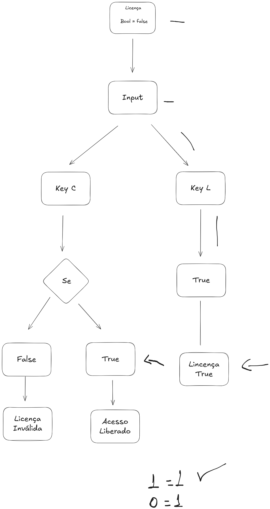

# 🕹️ HandsOn C# - Developer Games

---

### 🎯 Exercises Objectives
* **Organization:** Structuring code within proper namespaces and methods to avoid "spaghetti code".
* **Variable Manipulation:** Handling system states using boolean logic for access control.
* **Optimization:** Ensuring efficient input detection and clean execution flows.

---

### 🔒 Phase 2: The "Security Lock" Challenge (Business Logic)

This exercise simulates a Software Architect's approach to real-world business rules, specifically mimicking a "Seat (1/1)" access error.

* **The Task:** Implement a boolean variable `hasActiveLicense` initialized as `false`.
* **The Actions:** 1. **Activation:** Pressing the **L** key sets the license to `true`.
    2. **Access:** Pressing the **C** key (Customize) allows entry only if the license is active.
    3. **Error Handling:** If unauthorized, the system must trigger a "Seat Unavailable" warning.
* **The Objective:** Master conditional statements ($if/else$) applied to daily business logic requirements.

---

### 📊 Flowchart




> **Architectural Note:** The flow ensures that the system state is checked before any high-level functionality is executed, preventing logical bypasses.

---

### ✅ Resolution Summary

The primary goal is to validate a license to grant access permission. Without a valid state, the system remains locked, preventing unauthorized use of resources.

#### **Implementation Code:**

```csharp
using System;
using UnityEngine;

namespace LicenseValidation 
{ 
    public class SeatsManager : MonoBehaviour
    {
        // Initial State
        [Header("Security Settings")]
        [SerializeField] private bool isLicenseActive; // Logic variable for state management

        [Header("Input Controls")]
        public KeyCode activationKey = KeyCode.L; // Key to grant license
        public KeyCode accessKey = KeyCode.C;     // Key to attempt access
       
        void Update()
        {
            HandleLicenseInput();
        }

        // Methods 
        public void HandleLicenseInput()
        {
            // Action 1: Activate License
            if (Input.GetKeyDown(activationKey))
            {
                isLicenseActive = true;
                Debug.Log("License Granted/Released");
            }

            // Action 2: Check for Access attempt
            if (Input.GetKeyDown(accessKey))
            {
                ExecuteAccessValidation();
            }
        }

        public void ExecuteAccessValidation()
        {
            // Business Logic Check
            if (isLicenseActive)
            {
                Debug.Log("Access Authorized: Welcome!");
            }
            else
            {
                Debug.LogWarning("Error: Seat Unavailable. License required to proceed.");
            }
        }
    }
}